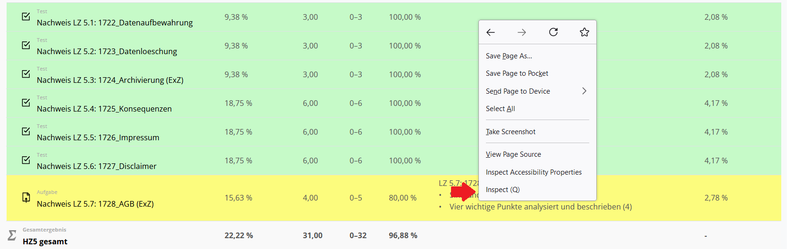
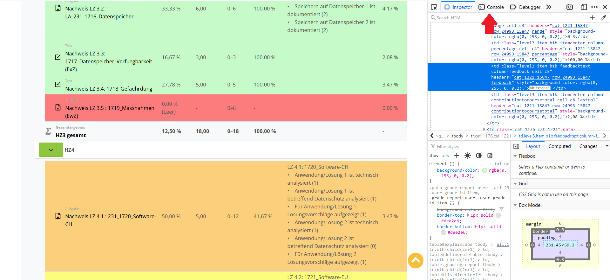
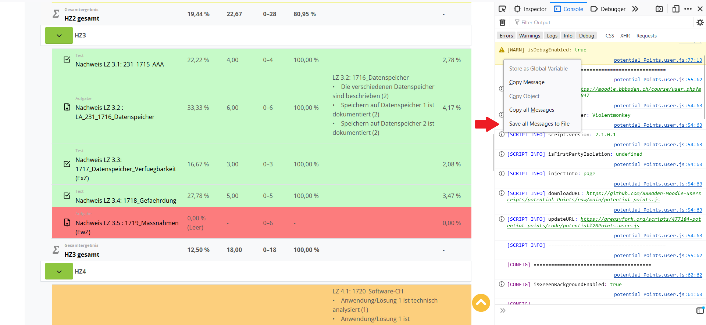

# Saving Console Output

In some cases, you may need to save console output from your userscript for future reference. This guide will walk you through the process.

## Step 1: Open Inspector

1. Right-click on your web page.
2. Click on the "Inspect" option.

## Step 2: Open Console

Switch to the "Console" tab.

## Step 3: Save Console

1. Right-click on your web page.
2. Select "Save all Messages to File."

## Step 4: Open Download Folder
Open the download folder.
