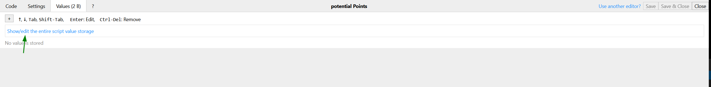

# Userscript Guide: Adding a Value to the Script

In some cases, you may need to add a value to your userscript for future reference or customization. This guide will walk you through the process.

### Step 1: Open Your Userscript

1. Open the userscript you want to work on.
2. Click on the "Values" tab.

### Step 2: Adding a New Value

To add a new value, follow these steps:

- Click on the "Add New Value" button.
- Give your value a meaningful name.

### Step 3: Adding Data to the Value

Once you've created the value, you can add data to it. This data can be used within your script for various purposes.

### Step 4: Viewing Stored Values

You can always review all the stored values in your userscript. This allows you to manage and utilize them effectively in your script.

By following these steps, you can enhance the functionality and customization options of your userscripts.
