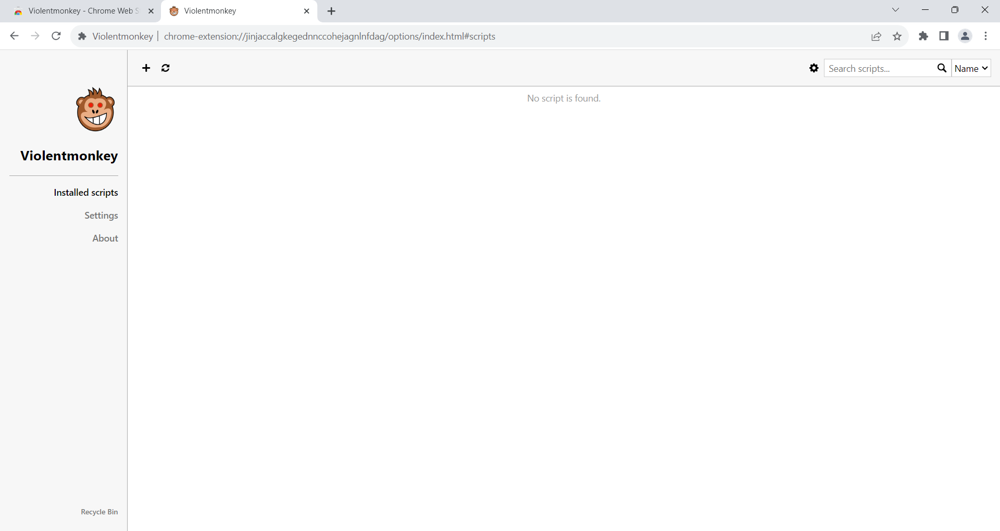

## Installation Guide for Violentmonkey Userscript

**Step 1: Download Violentmonkey**

start by visiting [this website](https://violentmonkey.github.io/#installation) to download Violentmonkey. Then, click on the icon of your web browser.  
&nbsp;

**Step 2: Add to Browser**

After completing Step 1, a new website will open. Click the "Add to Browser" button.  
&nbsp;

**Step 3: Allow Installation**

A small popup will appear, asking if you allow the installation of this extension. Press "Yes" to proceed.  
&nbsp;

**Step 4: Open Extension**

  
&nbsp;

**Step 5: Open Violentmonkey Dashboard**

Now, open the dashboard of Violentmonkey.  
&nbsp;

**Step 6: View Installed Scripts**

Here, you can view all the installed scripts.  
&nbsp;

**Congratulations!** You have successfully installed Violentmonkey and can now manage your scripts with ease.

**[next](../userscripts/add-userscript.md)**
