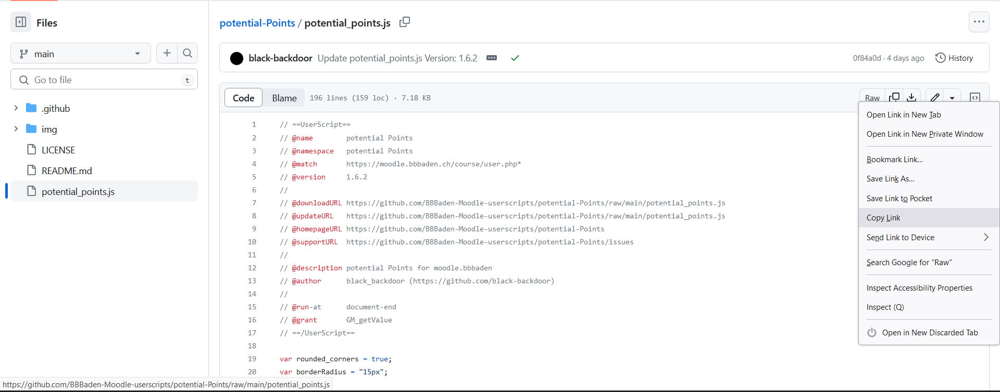
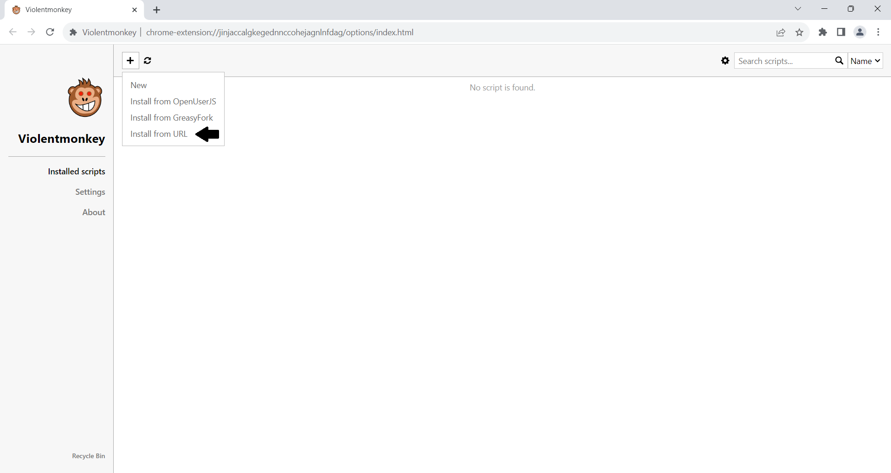
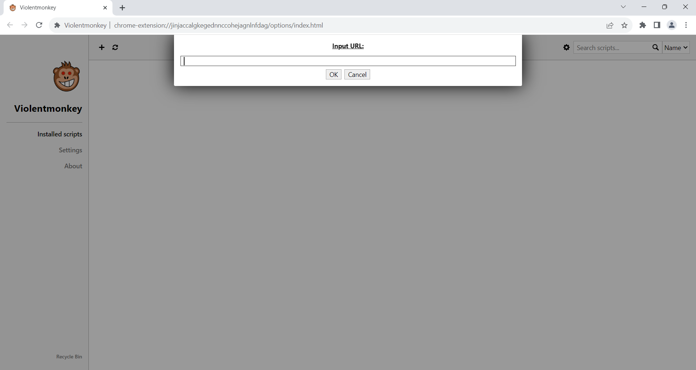

# Adding Userscripts from GitHub

## Step 2

1. Right-click on the "Raw" button.
2. Select "Copy Link."

&nbsp;  
Now, go back to Violentmonkey and add the script by link.

Paste the copied link.
