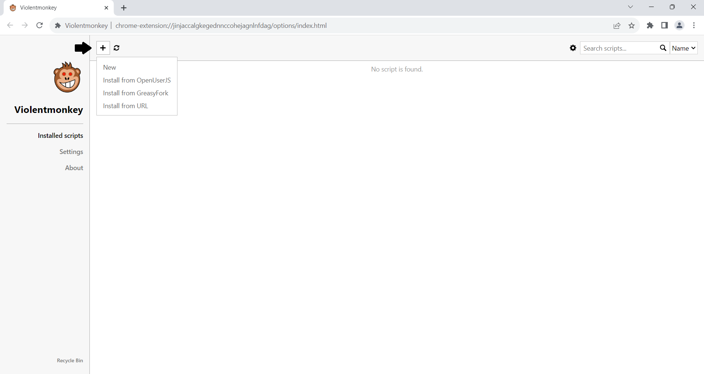
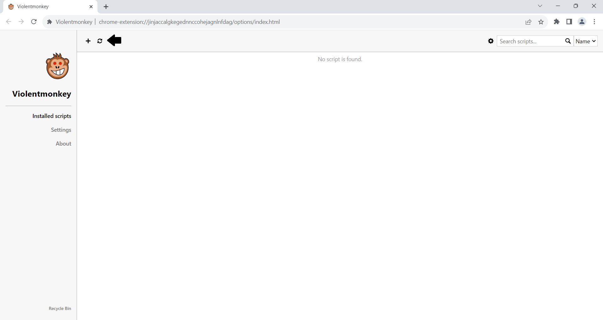

# **🚀 Userscript Installation Guide**  
Before you begin, ensure that you have a **userscript extension** installed in your browser. If you haven’t installed one yet, follow the link below to get started.

[**🔧 Install Userscript Extension**](../extension/install-extension.md)

## **1. How to Add a Userscript**  
Adding a userscript is easy! The quickest way to add a script is by using its **URL**. You can also install scripts directly from GitHub.

### **Install Scripts from GitHub**  
Follow these steps to install scripts from GitHub:  
[**📂 Scripts from GitHub**](add-scripts-from-github.md)

## **2. How to Update Your Userscripts**  
Updating your userscripts is a breeze! Simply click the **circle button** to update your existing scripts to the latest version.

